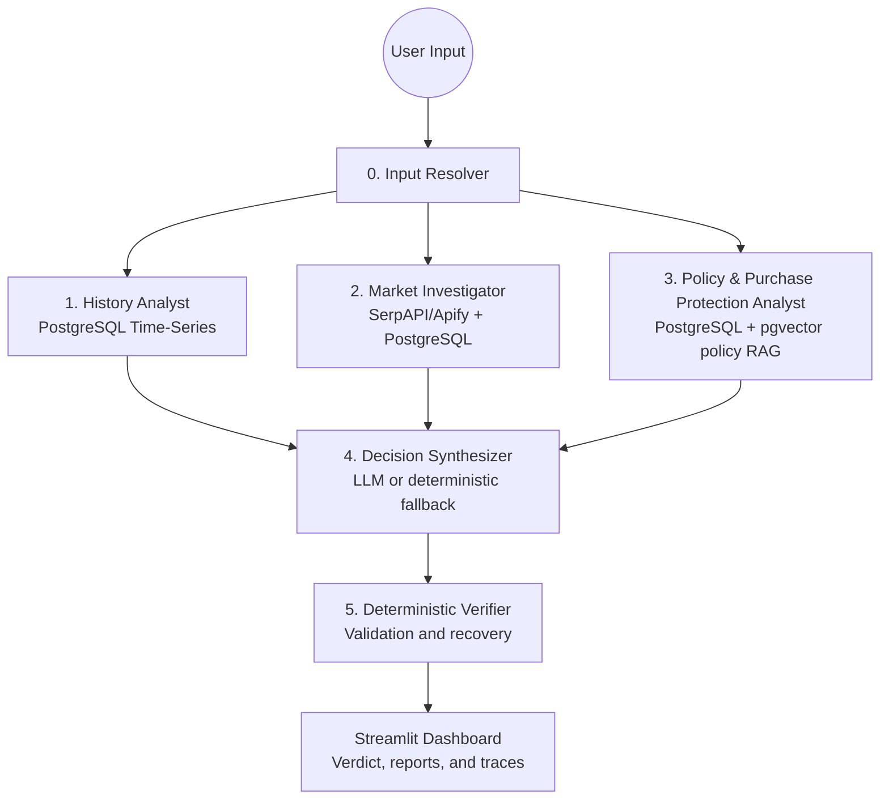

# PriceLens — System Design and Implementation

PriceLens is a multi-agent India e-commerce analysis system. It combines stored
price history, current offers from SerpAPI/Apify, and grounded retailer-policy
evidence. Three specialist agents run in parallel, followed by a decision
synthesizer and a deterministic verifier. The Streamlit dashboard displays the
combined recommendation alongside the specialist reports and execution traces.

This document describes the current executable implementation. Earlier design
plans may describe features or rules that differ from the running code.

## Project Purpose and Scope

PriceLens helps shoppers compare three aspects of an electronics purchase:

- **Timing:** How does the current price compare with stored historical prices?
- **Market value:** Which matching retailer offers and promotions are available?
- **Purchase protection:** What do saved retailer policies say about returns,
  replacements, refunds, cancellations, and warranties?

The supported retailer scope is Amazon India, Flipkart, Croma, Reliance Digital,
and Vijay Sales. Actual coverage depends on provider results and the approved
policy corpus. PriceLens provides advice; checkout, payments, order tracking,
and autonomous purchasing are outside the implemented workflow.

---

## System Architecture

PriceLens uses **LangGraph** for product resolution and three independent
specialist reports. All three agents fan out after input resolution, write
separate report fields, and join before synthesis. Agent 3 does not depend on
Agent 2 offers.



### 0. Input Resolver

`input_resolver_node` in `orchestrator.py` accepts product names, ten-character
ASINs, and Amazon URLs containing `/dp/<ASIN>`. Text queries use PostgreSQL
trigram similarity to find candidates, followed by relevance and requested-variant
checks. Ambiguous matches produce a resolution error instead of selecting an
arbitrary variant for history analysis. The resolver also infers the product
category and sets the retailer scope.

### 1. History and Trend Analyst

`tools/analytics.py` calculates historical statistics in Python and SQL. The
history node exposes `check_price_trend` and `get_historical_sale_drops` as tools
and can use a ReAct model to explain their results.

- Reads current price, observed all-time low and high, overall average, and an
  average over the latest 30 observations.
- Calculates the share of stored observations more expensive than today's price.
- Produces a history score and a historical buying stance:

  ```text
  S_history = clamp(100 × (1 - (current_price - ATL) / (ATH - ATL)), 0, 100)
  Flat price range: S_history = 50
  Historical stance: BUY_NOW if S_history >= 75; otherwise WAIT
  ```

- Uses stored product aggregates when dated history is absent, explicitly marking
  `evidence_mode: stored_aggregates`. Aggregate imports do not invent dated rows.
- Uses sale-drop analysis to provide a possible target price for a WAIT stance.

ATL and ATH describe the available stored evidence. The implementation does not
require a complete 365-day series; `total_history_days` counts observations, and
the recent average is not necessarily a continuous 30-calendar-day average.

### 2. Market and Offer Investigator

`MarketInvestigatorAgent` in `tools/market_agent.py` resolves the product family,
loads or refreshes observations, normalizes provider responses, validates offers,
and groups results by variant before ranking them.

- Supports `api_first`, `database_first`, and `database_only` provider policies.
- Uses SerpAPI for discovery and configured Apify actors for listing and
  promotion enrichment; stored observations can fill gaps in live coverage.
- Distinguishes listed and verified offers, unconditional prices, and conditional
  promotions that depend on bank, card, or EMI eligibility.
- Reports variant groups, best offers, freshness, provider runs, warnings,
  confidence, and the executed tool trace.

Optional model planning and summaries operate around deterministic matching,
validation, and ranking. Available evidence determines the report's completeness.

### 3. Policy and Purchase Protection Analyst

`PolicyProtectionAgent` in `tools/eligibility_agent.py` builds retailer-level
profiles for return, replacement, refund, cancellation, and warranty evidence.

1. Plan policy searches using product category and retailer scope.
2. Retrieve approved saved documents from the active `policy_local` corpus using
   PostgreSQL full-text search and pgvector similarity.
3. Merge keyword and semantic rankings through reciprocal rank fusion,
   contributing `1 / (60 + rank)` for each retrieval source.
4. Resolve active chunks, validate usable evidence, and build cited profiles.
5. Verify the report and expose missing evidence, warnings, and a summary.

Semantic retrieval failure falls back to keyword results with a warning. No
active corpus produces insufficient evidence. The agent does not download live
policy pages, consume Agent 2 offers, certify individual sellers, or issue its
own BUY/WAIT verdict.

### 4. Decision Synthesizer

`tools/decision_synthesizer.py` normalizes the three reports into synthesis inputs.
It prefers `best_conditional_offer` when present, otherwise
`best_unconditional_offer`. A configured model produces a single JSON draft;
missing credentials, model errors, or parsing errors select deterministic fallback.

The output decision vocabulary is `BUY_NOW`, `WAIT`, and `REFUSE_NO_HISTORY`.
The current deterministic rules are:

1. If an upcoming-sales entry has `days_away <= 14`, return WAIT.
2. Otherwise, if historical stance is BUY_NOW and an offer exists, return BUY_NOW.
3. Otherwise, return WAIT with an available historical target.

The model prompt also includes policy-safety and promotion override rules that
are not fully mirrored by the fallback. Policy gaps affect fallback confidence,
but do not impose a deterministic WAIT override. Confidence is a heuristic,
not a calibrated probability.

### 5. Deterministic Verifier and Recovery

`tools/verifier_gate.py` checks the draft before it becomes `final_verdict`:

- **BUY_NOW:** Compare the target with the lowest ranked price for the matching
  retailer, including variant-group offers, allowing INR 100 difference.
  A retailer absent from ranked offers receives `PARTIAL` status rather than
  rejection.
- **WAIT:** When corresponding history values exist, require a supplied target
  to be below the overall average and no lower than 85% of the observed ATL.
  A missing target is allowed.
- **Web evidence:** Check that `WEB_SEARCH_URL` references start with HTTP or
  HTTPS. This is a syntax check, not full source-membership verification.

If an LLM draft fails, the graph creates a deterministic replacement and verifies
it again. An unrecovered rejection clears recommendation values and returns
`REJECTED`. Successful results include verification status, a timing rationale,
and a BUY_NOW deal score weighted by history (50%), market confidence (30%),
and a policy-gap heuristic (20%).

The old minimum-history constants remain in the files, but a minimum-history
threshold is no longer enforced by the synthesizer or verifier.


## Tech Stack
* **Orchestration:** LangGraph, LangChain
* **LLM Engine:** Optional OpenAI-compatible guarded tool planning and summaries;
  deterministic execution and fallbacks
* **Database:** Neon PostgreSQL (`psycopg2`), with local PostgreSQL for tests
* **Vector Store:** Neon PostgreSQL with pgvector
* **UI/Frontend:** Streamlit, Plotly Express
* **Live data:** SerpAPI and Apify provider adapters
* **Testing:** pytest, with RAG evaluation assets using DeepEval

---

## Getting Started

### 1. Clone & Environment Setup
Clone the repository and activate your Python virtual environment:
```bash
# Example using venv
python3 -m venv .venv
source .venv/bin/activate
```

### 2. Install Dependencies
Install the required packages from the generated `requirements.txt`:
```bash
pip install -r requirements.txt
```

### 3. Start local data services and configure `.env`

```bash
docker compose up -d postgres
cp .env.example .env
```

```bash
# New database only: create the base tables and reference data.
python scripts/db/init_db.py

# New or existing database: apply unapplied migrations.
python scripts/db/migrate.py
```

### 4. Run the Dashboard
Launch the interactive Streamlit UI:
```bash
streamlit run app.py
```
The dashboard has one unified product input and an optional live-market checkbox,
which defaults to off. Submitting the form runs all three agents, synthesis, and
verification. Results are retained in Streamlit session state.

- **Final Synthesized Verdict:** decision, confidence, target price, retailer,
  and rationale.
- **Agent 1 report:** historical metrics and price chart where dated data exists.
- **Agent 2 report:** offer comparisons, variants, promotions, and market evidence.
- **Agent 3 policy report:** retailer profiles, evidence gaps, citations, and trace.
- **Execution flow:** stage progress and tool-level traces.

With live-market fetching disabled, the graph uses `database_only` for market
providers. Optional model calls and query embeddings may still use external
services; this setting does not make the entire application offline. Bank, card,
EMI, and deadline preferences exist in internal request contracts but are not all
exposed by the unified form.

### 5. Run the Market Investigator data pipeline

The live-market pipeline uses the same `DATABASE_URL` and `products` catalog as
the historical analyst. It adds append-only market run, offer, seller-detail,
and promotion tables without replacing the existing history tables.

Configure `SERPAPI_API_KEY` and `APIFY_API_TOKEN` in the ignored `.env`, then
fetch and persist offers from both providers:

```bash
python scripts/market_search.py "Apple iPhone 16 128GB"
```

Use `--providers serpapi` or `--providers apify` to run one provider. SerpAPI
uses Amazon Search and Google Shopping for discovery. Optional Amazon Product
API enrichment is disabled by default and can be enabled with
`SERPAPI_ENRICH_AMAZON=true`. Apify enriches the cheapest discovered listings
with configured Flipkart and bank-offer actors.

### 6. Build and test Agent 3 locally

Agent 3 uses only saved files from `data/policies/corpus/`, listed in
`data/policies/curated_manifest.json`. See that folder's README for required
metadata. No policy web downloads, search, or Apify fallback are enabled.
Validate the selected files, then publish embeddings to your configured Neon
database (the additive `policy_local` schema):

```bash
python scripts/policies/import_local_documents.py
python scripts/policies/init_local_schema.py
python scripts/policies/import_local_documents.py --publish
python scripts/policies/validate_policy_index.py "Can I return a defective phone?" --retailer Flipkart
```

Test Agent 3 independently after policy indexing:

```bash
python scripts/run_eligibility_agent.py \
  "Samsung S24 Ultra 8GB/256GB Graphite" \
  --product-category smartphone
```

To import the supplied product catalog for Agents 1 and 2:

```bash
python scripts/dev/import_products_json.py /path/to/products.json
```

The importer upserts product aggregates for Agent 1 and creates Agent 2 Amazon
snapshots only for rows with a raw ASIN and positive current price. It does not
turn aggregate ATL/ATH values into invented dated `price_history` rows; Agent 1
uses those aggregates transparently when no dated series exists.

`policy_local.documents` stores the local snapshots and provenance;
`policy_local.chunks` stores bounded chunks, source spans, and pgvector embeddings.
Publication atomically switches the active build after validation. Legacy policy
tables are retained but excluded from Agent 3 retrieval. No published local build
means an explicit missing-corpus result, not a fallback to web-ingested evidence.

---

## Reliability and Security

Market and policy nodes return structured errors so that available specialist
evidence can still reach synthesis. Provider outages can fall back to stored
observations; model failures can fall back to deterministic behavior. Missing
policy evidence is exposed as a gap rather than an invented protection claim.

Credentials are configured server-side through environment variables. Product
queries and evidence may be sent to configured providers and model services.
The prototype does not implement production authentication, tenant isolation,
or rate limiting. Production hardening should also redact detailed exceptions,
escape untrusted HTML-rendered content, and define data-retention rules.

## Testing and Current Validation Status

Tests under `tests/` cover matching, provider normalization, promotions, market
validation, policy chunking and retrieval, database migrations, orchestration,
UI behavior, synthesis, and verification. Live and database-dependent tests need
their respective configuration; a focused recommendation check is:

```bash
python -m pytest tests/test_decision_synthesizer.py tests/test_verifier_gate.py -q
```

On 28 September 2026, this focused run returned **17 passed and 4 failed**.
The four failures expect refusal or rejection for missing or insufficient price
history, while the current implementation has removed that restriction. Code,
tests, and the intended missing-history contract therefore need reconciliation.
This was not a full-suite, live-provider, or deployment acceptance run.

## Known Limitations and Next Steps

- Saved policy snapshots can become outdated, and retailer coverage can be
  incomplete. Policy profiles are retailer-level, not offer-specific eligibility.
- Model and fallback synthesis rules differ. They should share one explicit
  decision policy and matching tests.
- Verification is limited: an unmatched retailer can receive a partial pass,
  URL checks establish syntax only, and exact variant, seller, and evidence
  membership are not comprehensively checked at the final gate.
- The unified verdict panel does not prominently display `verification_status`,
  even though the final report contains it.
- Seeded sale-calendar dates are reference assumptions, not proof of confirmed
  upcoming events. Historical aggregates do not establish continuous coverage.
- Historical evidence retains the legacy `DUCKDB_RECORD` label although the
  implementation uses PostgreSQL.

Priority improvements are aligned decision rules and tests, stronger final
grounding checks, clearer partial-status presentation, policy refresh governance,
and production access controls.