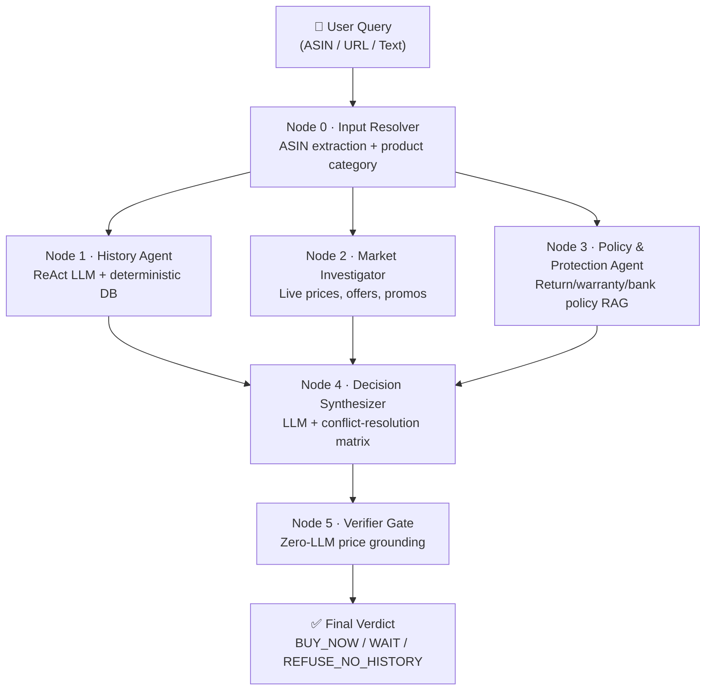
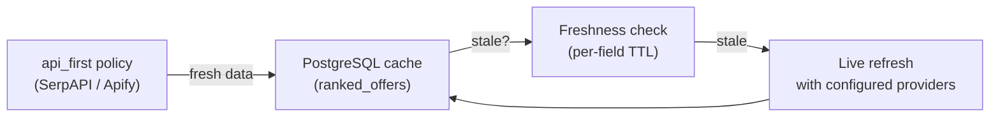
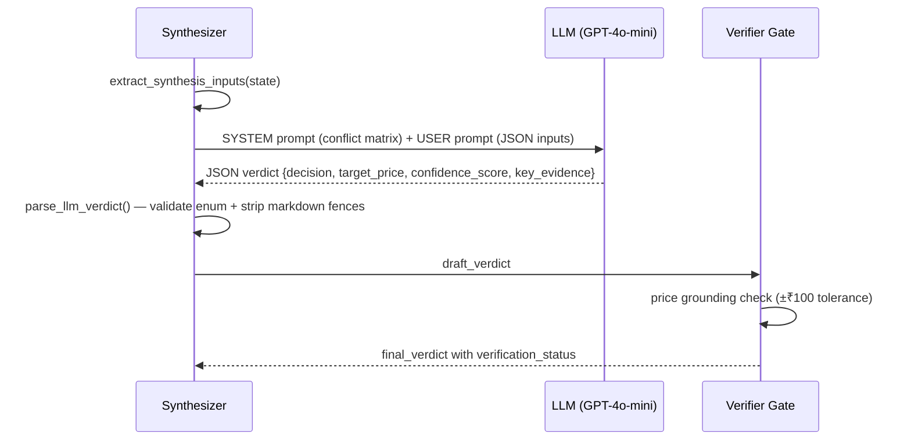
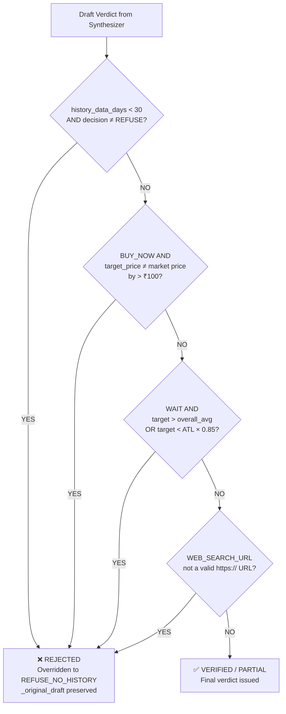

# PriceLens — AI Architecture Deep Dive

> A smart AI price lens for electronics: how agents reason, handle partial data, surface policy protection, and how the synthesizer creates the final verdict.

---

## 1. The Big Picture — System Flow



> [!IMPORTANT]
> Nodes 1, 2, and 3 run **concurrently** (LangGraph fan-out). Each writes to a **disjoint state key** (`history_report`, `market_report`, `policy_report`) — no race conditions.

---

## 2. How AI Ensures Best Response — Per-Agent Design

### Node 1 · History Agent ([`orchestrator.py#L135`](file:///Users/saiprasad/Desktop/Projects/PriceLens/orchestrator.py#L135-L294))

**What it does:** Measures *how expensive is this product right now vs. its history*.

| Signal | Meaning |
|--------|---------|
| `S_history` (0–100) | 100 = at all-time low; 0 = at all-time high |
| `true_atl` | Verified absolute lowest price ever recorded |
| `overall_avg` | Mean price across the entire history window |
| `safe_target_price` | Best price historically seen during mega-sales |
| `historical_stance` | `BUY_NOW` or `WAIT` — pure deterministic DB math |

**Two-layer architecture:**
1. **Deterministic DB layer** — always runs first. [`query_historical_trend()`](file:///Users/saiprasad/Desktop/Projects/PriceLens/tools/analytics.py) queries stored price history. Never fails silently.
2. **LLM ReAct layer** — wraps the DB output in 3 sentences of financial commentary. If the LLM is offline → falls back to a pre-written template matching the stance.

---

### Node 2 · Market Investigator ([`market_agent.py`](file:///Users/saiprasad/Desktop/Projects/PriceLens/tools/market_agent.py))

**What it does:** Finds *the best live offer right now across Amazon, Flipkart, Croma, etc.*

**Three-tier provider waterfall:**



**What it surfaces per offer:**
- `price`, `effective_price` (after bank promos)
- `promotion_count` — how many bank/card offers apply
- `seller_name`, `condition` (NEW / RENEWED / USED)
- `delivery_eta`, `in_stock`
- `best_conditional_offer` (with bank promo) vs. `best_unconditional_offer`
- `variant_groups` — groups colour/storage variants together

---

### Node 3 · Policy & Protection Agent ([`eligibility_agent.py`](file:///Users/saiprasad/Desktop/Projects/PriceLens/tools/eligibility_agent.py))

**What it does:** Retrieves *retailer return/warranty/bank policy evidence* using Hybrid RAG (PostgreSQL + Chroma vector search) — completely independent of which offer is cheapest.

**What it surfaces:**
- Return window per retailer (7-day / 10-day / 30-day)
- Warranty type (brand vs. seller)
- Bank EMI eligibility, no-cost EMI offers
- Cross-retailer observations (e.g., "Croma has 15-day return; Amazon has 7-day")
- `evidence_gap_count` — how many policy questions remain unanswered

> [!NOTE]
> This agent's output is **offer-independent by design**. It answers "which retailer has the best protection" before knowing which retailer has the best price. The synthesizer combines both signals.

---

## 3. Handling Partial Responses

This is one of the most important design challenges. PriceLens handles it in **four distinct ways**:

### 3a. Agent-level graceful degradation

Every agent node is wrapped in `try/except`. If an agent fails entirely, it returns a minimal stub report with `status: "error"`:

```python
# market_agent_node — orchestrator.py#L358
except Exception as exc:
    return {
        "market_report": {
            "status": "error",
            "signals": ["INSUFFICIENT_EVIDENCE"],
            "warnings": [str(exc)],
            "summary": "Market analysis could not be completed.",
        }
    }
```

The synthesizer's [`extract_synthesis_inputs()`](file:///Users/saiprasad/Desktop/Projects/PriceLens/tools/decision_synthesizer.py#L13-L60) uses `or {}` fallback at every field access — **it never crashes on a missing agent report**.

### 3b. Partial verification status (Verifier Gate)

When the verifier gate can't fully ground a price (e.g., retailer exists in the verdict but isn't in `ranked_offers` yet because it's fresh live data), it issues a **soft pass**:

```python
# verifier_gate.py#L91-L103
if not candidate_prices:
    return VerificationResult(
        passed=True,
        reason="VERIFIER_PARTIAL: retailer not found in ranked_offers",
        final_verdict={
            **draft,
            "verification_status": "PARTIAL",   # ← user sees this
            ...
        },
    )
```

`verification_status` can be: `VERIFIED` | `PARTIAL` | `REJECTED`

### 3c. History-gated refusal

If price history is < 30 days, the entire recommendation is refused — it's unsafe to advise BUY/WAIT on thin data:

```python
# decision_synthesizer.py#L139-L154
if data_days < MIN_HISTORY_DAYS:
    return {
        "decision": "REFUSE_NO_HISTORY",
        "confidence_score": 1.0,  # high confidence in refusal itself
        "primary_rationale": f"Only {data_days} days of history..."
    }
```

### 3d. LLM vs. deterministic mode tagging

Every verdict carries `_synthesis_mode` so the UI can tell the user:
- `"llm"` → full AI reasoning used
- `"deterministic_fallback"` → rules engine used (LLM offline/invalid)
- `"error_fallback"` → synthesizer itself crashed

---

## 4. How Agents Report Available vs. Unavailable Information

Each agent surfaces **what it found AND what it couldn't find** through structured signals:

### History Agent
```
history_report.trend.s_history        # always populated if ASIN exists in DB
history_report.trend.total_history_days  # 0 if no data → triggers REFUSE
history_report.drops.safe_target_price   # null if no sale events recorded
```

### Market Agent
```
market_report.status          # "ok" | "stale" | "no_offers" | "error"
market_report.signals         # ["INSUFFICIENT_EVIDENCE"] when empty
market_report.warnings        # human-readable explanation of gaps
market_report.best_conditional_offer    # null if no bank promo found
market_report.best_unconditional_offer  # null if no offers found at all
```

### Policy Agent
```
policy_report.status               # "ok" | "partial" | "error"
policy_report.evidence_gap_count   # number of unanswered policy questions
policy_report.cross_retailer_observations  # [] if no policy hits
policy_report.summary              # "No policy data available" when empty
```

> [!TIP]
> The synthesizer reads `evidence_gap_count` from the policy report and uses it to **penalize the confidence score**:
> ```python
> 0.20 * (0.0 if inputs.get("policy_gaps") else 1.0)
> ```
> A recommendation with missing policy data gets a lower confidence score — the user sees this signal.

---

## 5. How Agents Surface Reasoning to the Synthesizer

Each agent outputs a structured **trace** alongside its data report. This trace powers both the Streamlit UI live updates and gives the synthesizer structured reasoning.

### Agent Trace Format
```json
{
  "stage": "retrieve_retailer_policy_evidence",
  "tool": "PostgreSQL + Chroma hybrid RAG",
  "status": "completed",          ← "completed" | "skipped" | "fallback" | "error"
  "source": "database",
  "input_summary": "smartphones; Amazon India, Flipkart",
  "output_summary": "Retrieved 4 active policy chunks for Amazon India",
  "duration_ms": 142.5,
  "display_prompt": null
}
```

**The synthesizer doesn't directly read agent traces** — instead it reads the *distilled outputs* from each agent:

```
Agent 1 → history_report.trend  (mathematical baseline)
         + history_report.llm_analysis  (3-sentence narrative)

Agent 2 → market_report.best_offer  (grounded live price)
         + market_report.signals     (e.g. UPCOMING_SALE)
         + market_report.upcoming_sales

Agent 3 → policy_report.evidence_gap_count  (data completeness signal)
         + policy_report.cross_retailer_observations
         + policy_report.summary
```

This design is intentional — each agent is a **specialist reporter**, and the synthesizer is the **editor** who weighs their reports.

---

## 6. How the Synthesizer Creates the Final Response

The synthesizer ([`decision_synthesizer.py`](file:///Users/saiprasad/Desktop/Projects/PriceLens/tools/decision_synthesizer.py)) runs in two modes:

### Mode A — LLM Synthesis (when `OPENAI_API_KEY` is set)



**What the LLM sees (system prompt rules):**

| Rule | Trigger | Decision |
|------|---------|----------|
| Rule 0 | `history_data_days < 30` | `REFUSE_NO_HISTORY` (hard override) |
| Rule 1 | Any upcoming sale ≤ 14 days away | `WAIT` |
| Rule 2 | `historical_stance == BUY_NOW` AND `promotion_count > 0` | `BUY_NOW` |
| Rule 3 | `historical_stance == BUY_NOW` AND `best_offer exists` | `BUY_NOW` |
| Rule 4 | All other cases | `WAIT` |

### Mode B — Deterministic Fallback (no LLM / LLM failure)

The exact same conflict resolution matrix is implemented in pure Python ([`deterministic_synthesis()`](file:///Users/saiprasad/Desktop/Projects/PriceLens/tools/decision_synthesizer.py#L132-L237)) — **zero hallucination risk**, always produces a valid structured verdict.

### Confidence Score Formula
```
confidence = 0.50 × (S_history / 100)          # history signal weight
           + 0.30 × market_confidence           # market signal weight
           + 0.20 × (1.0 if policy_gaps==0 else 0.0)  # policy completeness
```

### Evidence Grounding

The synthesizer is instructed to only reference IDs or URLs **present in the input JSON**:
- `DUCKDB_RECORD` → references the canonical ASIN from price history DB
- `SERP_SHOPPING_OFFER` → references the `offer_id` from market DB
- `WEB_SEARCH_URL` → must be a valid `https://` URL

The verifier gate then **independently checks** that the `target_price` in the verdict matches an actual offer in the market report within ±₹100. If it doesn't → verdict is rejected and overridden.

---

## 7. The Verifier Gate — A Second Opinion on the AI



> [!CAUTION]
> The verifier gate **never calls an LLM**. It is purely deterministic. This means even if the LLM hallucinates a price, the gate catches it. The `_original_draft` is preserved in the rejected verdict so you can debug what the LLM suggested.

---

## 8. Complete Data Flow Summary

```
User Query
    │
    ▼
[Input Resolver]  → canonical_id, product_category, retailer_scope
    │
    ├──────────────────────────────────────┐──────────────────────────────┐
    ▼                                      ▼                              ▼
[History Agent]                    [Market Agent]                [Policy Agent]
 ● S_history score                  ● ranked_offers               ● return window
 ● ATL / ATH / avg                  ● best_conditional_offer      ● warranty type
 ● sale event drops                 ● upcoming_sales              ● bank EMI
 ● LLM 3-sentence analysis          ● freshness status            ● evidence_gap_count
    │                                      │                              │
    └──────────────────────────────────────┴──────────────────────────────┘
                                           │
                                           ▼
                                 [Decision Synthesizer]
                                  LLM or deterministic
                                  conflict resolution matrix
                                  → draft_verdict
                                           │
                                           ▼
                                   [Verifier Gate]
                                   price grounding
                                   history sufficiency
                                   URL validity
                                   → final_verdict

final_verdict fields:
  decision:                    BUY_NOW | WAIT | REFUSE_NO_HISTORY
  target_price:                ₹ amount or null
  recommended_retailer:        "Amazon India" | "Flipkart" | ...
  recommended_seller:          seller name or null
  condition:                   NEW | RENEWED | USED
  confidence_score:            0.0 – 1.0
  primary_rationale:           human-readable explanation
  key_evidence:                grounded source references
  verification_status:         VERIFIED | PARTIAL | REJECTED
  effective_deal_score:        0–100 composite deal quality
  timing_and_safety_rationale: policy summary + timing advice
  _synthesis_mode:             llm | deterministic_fallback | error_fallback
```

---

## 9. Key Design Principles

| Principle | Implementation |
|-----------|---------------|
| **Never hallucinate prices** | Verifier gate checks ±₹100 tolerance against DB |
| **Graceful degradation** | Every agent has `try/except` + stub fallback |
| **Partial > nothing** | `PARTIAL` verification status instead of crashing |
| **Deterministic safety net** | Conflict matrix in pure Python, no LLM required |
| **Transparent reasoning** | `_synthesis_mode` tag + `key_evidence` array with source types |
| **Policy-aware confidence** | `evidence_gap_count` penalizes confidence score |
| **Data sufficiency gate** | < 30 days history → hard `REFUSE_NO_HISTORY` override |
