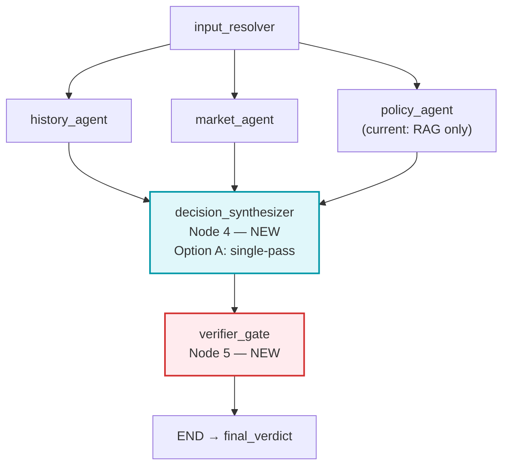

# PriceLens — Final Implementation Plan: Decision Synthesizer & Verifier Gate

## Goal

Implement **Node 4 (Decision Synthesizer)** and **Node 5 (Verifier Gate)** in [`orchestrator.py`](file:///Users/saiprasad/Desktop/Projects/PriceLens/orchestrator.py), replacing the current placeholders with a working end-to-end pipeline.

---

## Scope: What Is and Isn't Included

> [!IMPORTANT]
> **Agent 3 eligibility scoring is deliberately deferred.** [`eligibility_scoring.py`](file:///Users/saiprasad/Desktop/Projects/PriceLens/tools/eligibility_scoring.py) (seller classification, deal scores, safety status) is still being integrated into `policy_agent_node`. This plan does **not** touch Agent 3. The synthesizer is designed to work with the current `policy_report` output (policy profiles only) and will be upgraded once Agent 3 is complete.

> [!NOTE]
> **Looping = Option A (Single-Pass).** The synthesizer makes one LLM call and returns a decision. If confidence is low or data is insufficient → `REFUSE_NO_HISTORY`. Option B (conditional retry loop) will be evaluated after testing Option A results.

### What the Synthesizer Will Consume (current state)

| State Key | Key Fields Available Now |
|---|---|
| `history_report` | `trend.s_history`, `trend.historical_stance`, `trend.current_price`, `trend.true_atl`, `trend.overall_avg`, `trend.total_history_days`, `drops.safe_target_price`, `drops.upcoming_sale`, `llm_analysis` |
| `market_report` | `best_unconditional_offer`, `best_conditional_offer`, `ranked_offers`, `upcoming_sales`, `signals`, `confidence`, `summary`, `variant_groups` |
| `policy_report` | `policy_profiles`, `evidence_gap_count`, `cross_retailer_observations`, `summary` *(no variant_results yet — deferred)* |

---

## System Architecture



---

## Proposed Changes

---

### Component 1 — `tools/decision_synthesizer.py` [NEW]

**Purpose:** Normalise the 3 reports, run a single LLM call (temperature=0), parse the JSON output, and fall back to a deterministic rule engine if the LLM is offline or returns invalid output.

#### Internal Structure

```
run_synthesizer(state)
        │
        ├── extract_synthesis_inputs(state)   ← normalise 3 reports into flat dict
        │
        ├── [If OPENAI_API_KEY present]
        │       build_synthesis_prompt(inputs) → LLM call → parse_llm_verdict()
        │       On any exception  ──────────────────────────────────────────────┐
        │                                                                       │
        └── deterministic_synthesis(inputs)  ← pure-Python conflict matrix ←──┘
```

#### Conflict Resolution Matrix (both LLM prompt and deterministic fallback)

| Rule | Condition | Output |
|---|---|---|
| **Rule 0** | `total_history_days < 30` | `REFUSE_NO_HISTORY` — hard override |
| **Rule 1** | Any `upcoming_sale` with `days_away ≤ 14` | `WAIT` — even if history says BUY_NOW |
| **Rule 2** | `historical_stance == BUY_NOW` + `best_offer` has bank promo | `BUY_NOW` at conditional price |
| **Rule 3** | `historical_stance == BUY_NOW` + any verified offer exists | `BUY_NOW` at offer price |
| **Rule 4** | All other cases | `WAIT` with `safe_target_price` |

#### Best Offer Selection Strategy

Since Agent 3's safety scoring is deferred, the synthesizer selects the best offer from `market_report` using this priority:
1. `best_conditional_offer` (cheapest with bank promo, user's bank/card matched) → if `wants_emi` or `bank` is set
2. `best_unconditional_offer` (cheapest verified offer, no conditions)
3. First item in `ranked_offers` as last resort

#### Full Module Code

```python
"""tools/decision_synthesizer.py — Node 4: Decision Synthesizer (Option A: single-pass)."""
from __future__ import annotations

import json
import os

DECISION_ENUM = frozenset({"BUY_NOW", "WAIT", "REFUSE_NO_HISTORY"})
MIN_HISTORY_DAYS = 30


# ── Input normalisation ───────────────────────────────────────────────────────

def extract_synthesis_inputs(state: dict) -> dict:
    history = state.get("history_report") or {}
    market  = state.get("market_report")  or {}
    policy  = state.get("policy_report")  or {}

    trend = history.get("trend") or {}
    drops = history.get("drops") or {}

    # Prefer conditional offer (has bank promo) over unconditional
    best_offer = (
        market.get("best_conditional_offer")
        or market.get("best_unconditional_offer")
    )
    # Also collect ranked_offers for the verifier gate's price grounding
    ranked = list(market.get("ranked_offers") or [])
    for group in market.get("variant_groups") or []:
        ranked += group.get("ranked_offers") or []

    return {
        # History
        "s_history":         trend.get("s_history"),
        "historical_stance": trend.get("historical_stance", "WAIT"),
        "current_price":     trend.get("current_price"),
        "true_atl":          trend.get("true_atl"),
        "overall_avg":       trend.get("overall_avg"),
        "safe_target_price": drops.get("safe_target_price"),
        "upcoming_sale_name": drops.get("upcoming_sale"),
        "history_analysis":  history.get("llm_analysis", ""),
        "history_data_days": int(trend.get("total_history_days") or 0),

        # Market
        "market_status":     market.get("status"),
        "market_confidence": float(market.get("confidence") or 0.0),
        "best_offer":        best_offer,
        "ranked_offers":     ranked,
        "market_signals":    market.get("signals") or [],
        "upcoming_sales":    market.get("upcoming_sales") or [],
        "market_summary":    market.get("summary", ""),

        # Policy/Eligibility (current output — policy profiles only)
        "policy_status":     policy.get("status"),
        "policy_gaps":       int(policy.get("evidence_gap_count") or 0),
        "policy_summary":    policy.get("summary", ""),
        "cross_retailer":    policy.get("cross_retailer_observations") or [],

        # Note: policy_report.variant_results not yet available (Agent 3 WIP)
        # Synthesizer will use market_report for offer selection until then
    }


# ── LLM system prompt ─────────────────────────────────────────────────────────

SYNTHESIZER_SYSTEM = """\
You are the PriceLens Decision Synthesizer. You receive structured JSON from
three specialist agents and must output a single purchase recommendation.

STRICT RULES:
1. Reply with valid JSON ONLY — no markdown fences, no prose outside JSON.
2. "decision" must be exactly one of: "BUY_NOW", "WAIT", "REFUSE_NO_HISTORY".
3. "REFUSE_NO_HISTORY" is mandatory when history_data_days < 30.
4. BUY_NOW → "target_price" must equal best_offer.price from the input.
5. WAIT → "target_price" must equal safe_target_price from the input.
6. "confidence_score" is 0.0–1.0 reflecting signal convergence.
7. "key_evidence" must only reference IDs or URLs present in the input JSON.
8. Never invent prices, sellers, retailers, or URLs.

CONFLICT RESOLUTION MATRIX (apply strictly in this order):
  Rule 0: history_data_days < 30 → REFUSE_NO_HISTORY (hard override, no exceptions)
  Rule 1: Any upcoming_sales entry with days_away <= 14 → WAIT
  Rule 2: historical_stance == BUY_NOW AND best_offer.promotion_count > 0 → BUY_NOW
  Rule 3: historical_stance == BUY_NOW AND best_offer exists → BUY_NOW
  Rule 4: all other cases → WAIT

OUTPUT JSON SCHEMA:
{
  "decision": "BUY_NOW" | "WAIT" | "REFUSE_NO_HISTORY",
  "target_price": <number | null>,
  "recommended_retailer": <string | null>,
  "recommended_seller": <string | null>,
  "condition": "NEW" | "RENEWED" | "USED" | null,
  "confidence_score": <float 0.0–1.0>,
  "primary_rationale": <string, max 200 words>,
  "key_evidence": [
    {
      "source_type": "DUCKDB_RECORD" | "SERP_SHOPPING_OFFER" | "WEB_SEARCH_URL",
      "reference_id_or_url": <string>,
      "fact_summary": <string>,
      "verified": <boolean>
    }
  ]
}
"""


def build_synthesis_prompt(inputs: dict) -> str:
    """Serialise the normalised inputs as the LLM user message."""
    # Exclude ranked_offers (too large) — summarise instead
    safe = {k: v for k, v in inputs.items()
            if k != "ranked_offers" and v is not None}
    safe["ranked_offer_count"] = len(inputs.get("ranked_offers") or [])
    return json.dumps(safe, default=str, ensure_ascii=False, indent=2)


def parse_llm_verdict(content: str) -> dict:
    """Parse and validate LLM JSON output. Raises ValueError on bad output."""
    stripped = content.strip()
    # Strip markdown code fences if LLM added them
    if stripped.startswith("```"):
        stripped = stripped.split("```")[1]
        if stripped.startswith("json"):
            stripped = stripped[4:]
    verdict = json.loads(stripped.strip())
    if verdict.get("decision") not in DECISION_ENUM:
        raise ValueError(f"Invalid decision enum: {verdict.get('decision')!r}")
    return verdict


# ── Deterministic fallback ────────────────────────────────────────────────────

def deterministic_synthesis(inputs: dict) -> dict:
    """
    Pure-Python conflict resolution matrix — zero LLM, zero hallucination.
    Activated when LLM is offline, key is missing, or output is invalid.
    """
    data_days = inputs.get("history_data_days", 0)

    # Rule 0: Refuse — insufficient history
    if data_days < MIN_HISTORY_DAYS:
        return {
            "decision": "REFUSE_NO_HISTORY",
            "target_price": None,
            "recommended_retailer": None,
            "recommended_seller": None,
            "condition": None,
            "confidence_score": 1.0,
            "primary_rationale": (
                f"Only {data_days} days of price history available. "
                f"A minimum of {MIN_HISTORY_DAYS} days is required to make "
                "a reliable purchase recommendation."
            ),
            "key_evidence": [],
            "_synthesis_mode": "deterministic_fallback",
        }

    stance     = inputs.get("historical_stance", "WAIT")
    best_offer = inputs.get("best_offer") or {}
    upcoming   = inputs.get("upcoming_sales") or []
    s_history  = inputs.get("s_history")

    # Rule 1: Impending sale overrides even a good price
    imminent = [
        s for s in upcoming
        if isinstance(s.get("days_away"), (int, float)) and int(s["days_away"]) <= 14
    ]
    if imminent:
        sale = imminent[0]
        target = inputs.get("safe_target_price") or inputs.get("current_price")
        return {
            "decision": "WAIT",
            "target_price": target,
            "recommended_retailer": None,
            "recommended_seller": None,
            "condition": "NEW",
            "confidence_score": 0.85,
            "primary_rationale": (
                f"A verified {sale.get('sale_name', 'sale event')} is "
                f"{int(sale['days_away'])} days away. Waiting is recommended "
                "even though the current price is near its historical low."
            ),
            "key_evidence": _history_evidence(inputs),
            "_synthesis_mode": "deterministic_fallback",
        }

    # Rules 2 + 3: BUY_NOW conditions
    if stance == "BUY_NOW" and best_offer:
        has_promo = int(best_offer.get("promotion_count") or 0) > 0
        price     = best_offer.get("price") or best_offer.get("effective_price")
        retailer  = best_offer.get("retailer") or best_offer.get("marketplace")
        seller    = best_offer.get("seller_name") or best_offer.get("seller")
        reason    = "active bank promotion at" if has_promo else "verified offer at"
        rationale = (
            f"S_history={s_history} indicates the current price "
            f"(₹{inputs.get('current_price') or 0:,.0f}) is near the historical low. "
            f"There is a {reason} ₹{price:,.0f} from {retailer}. Recommended: BUY_NOW."
            if price else
            f"S_history={s_history} — current price near historical low. BUY_NOW."
        )
        confidence = round(
            0.50 * min(1.0, float(s_history or 0) / 100.0)
            + 0.30 * float(inputs.get("market_confidence") or 0)
            + 0.20 * (0.0 if inputs.get("policy_gaps") else 1.0),
            2,
        )
        return {
            "decision": "BUY_NOW",
            "target_price": float(price) if price else None,
            "recommended_retailer": retailer,
            "recommended_seller": seller,
            "condition": str(best_offer.get("condition") or "NEW").upper(),
            "confidence_score": confidence,
            "primary_rationale": rationale,
            "key_evidence": _history_evidence(inputs) + _offer_evidence(best_offer),
            "_synthesis_mode": "deterministic_fallback",
        }

    # Rule 4: Default WAIT
    target = inputs.get("safe_target_price") or inputs.get("true_atl")
    sale_name = inputs.get("upcoming_sale_name")
    return {
        "decision": "WAIT",
        "target_price": float(target) if target else None,
        "recommended_retailer": None,
        "recommended_seller": None,
        "condition": "NEW",
        "confidence_score": 0.70,
        "primary_rationale": (
            f"S_history={s_history} — current price is above the preferred "
            "historical buying range. "
            + (f"Wait for price near ₹{target:,.0f}" if target else "Wait for a price drop.")
            + (f" during {sale_name}." if sale_name else ".")
        ),
        "key_evidence": _history_evidence(inputs),
        "_synthesis_mode": "deterministic_fallback",
    }


# ── Evidence helpers ──────────────────────────────────────────────────────────

def _history_evidence(inputs: dict) -> list:
    cid = inputs.get("canonical_id") or "UNKNOWN"
    price = inputs.get("current_price")
    if not price:
        return []
    return [{
        "source_type": "DUCKDB_RECORD",
        "reference_id_or_url": cid,
        "fact_summary": (
            f"S_history={inputs.get('s_history')}, "
            f"current=₹{price:,.0f}, "
            f"ATL=₹{inputs.get('true_atl') or 'N/A'}, "
            f"history_days={inputs.get('history_data_days')}"
        ),
        "verified": True,
    }]


def _offer_evidence(offer: dict) -> list:
    if not offer:
        return []
    offer_ref = str(offer.get("offer_id") or offer.get("external_id") or "")
    price = offer.get("price") or offer.get("effective_price") or 0
    retailer = offer.get("retailer") or offer.get("marketplace") or "?"
    return [{
        "source_type": "SERP_SHOPPING_OFFER",
        "reference_id_or_url": offer_ref,
        "fact_summary": f"{retailer}: ₹{float(price):,.0f}",
        "verified": bool(offer_ref),
    }]


# ── Top-level entry point ─────────────────────────────────────────────────────

def run_synthesizer(state: dict) -> dict:
    """Called by decision_synthesizer_node in orchestrator.py."""
    inputs = extract_synthesis_inputs(state)
    inputs["canonical_id"] = state.get("canonical_id")

    api_key  = os.environ.get("OPENAI_API_KEY", "").strip()
    base_url = os.environ.get("OPENAI_BASE_URL", "https://api.openai.com/v1")
    model    = os.environ.get("OPENAI_MODEL", "gpt-4o-mini")

    if api_key:
        try:
            from langchain_openai import ChatOpenAI
            llm = ChatOpenAI(
                base_url=base_url, api_key=api_key,
                model=model, temperature=0,
            )
            response = llm.invoke([
                ("system", SYNTHESIZER_SYSTEM),
                ("user", build_synthesis_prompt(inputs)),
            ])
            verdict = parse_llm_verdict(str(response.content))
            verdict["_synthesis_mode"] = "llm"
            return verdict
        except Exception:
            pass  # fall through to deterministic

    return deterministic_synthesis(inputs)
```

---

### Component 2 — `tools/verifier_gate.py` [NEW]

**Purpose:** 3-check zero-LLM deterministic validation of the draft verdict. Validates against data already in LangGraph state — no new DB calls.

#### The 3 Checks

```
Check 1: Zero-History Guard
  → history_report.trend.total_history_days < 30 AND decision != REFUSE?
  → REJECT (override to REFUSE_NO_HISTORY)

Check 2A (BUY_NOW): Price Grounding
  → |target_price - db_price| > ₹100?
  → db_price = min price in market_report.ranked_offers for recommended_retailer
  → REJECT if difference exceeds ₹100 tolerance
  → PARTIAL if retailer not found in ranked_offers (soft pass)

Check 2B (WAIT): Target Boundary
  → target_price >= overall_avg?   → REJECT (must be lower than average)
  → target_price < ATL * 0.85?    → REJECT (unrealistically low)

Check 3: Evidence Lineage
  → Any key_evidence item with source_type=WEB_SEARCH_URL and ref not starting http?
  → REJECT (fabricated URL)

ALL PASS → Enrich verdict with:
  - verification_status: "VERIFIED"
  - effective_deal_score: weighted 0–100 (BUY_NOW only)
  - timing_and_safety_rationale: human-readable final string
```

#### Full Module Code

```python
"""tools/verifier_gate.py — Node 5: Deterministic Verifier Gate."""
from __future__ import annotations
from dataclasses import dataclass, field

PRICE_TOLERANCE_INR: float = 100.0  # ₹100 lenient (floating-point safe, confirmed)
MIN_HISTORY_DAYS: int = 30


@dataclass
class VerificationResult:
    passed: bool
    reason: str
    final_verdict: dict = field(default_factory=dict)


def verify_draft_verdict(
    draft: dict,
    state: dict,
    *,
    price_tolerance_inr: float = PRICE_TOLERANCE_INR,
) -> VerificationResult:
    decision  = str(draft.get("decision") or "")
    history   = state.get("history_report") or {}
    trend     = history.get("trend") or {}
    data_days = int(trend.get("total_history_days") or 0)

    # ── Check 1 ───────────────────────────────────────────────────────────────
    if data_days < MIN_HISTORY_DAYS and decision != "REFUSE_NO_HISTORY":
        return _reject(
            draft,
            f"VERIFIER_REJECT: {decision!r} proposed with only {data_days} "
            f"history days (minimum {MIN_HISTORY_DAYS}). Overriding to REFUSE_NO_HISTORY.",
            override_decision="REFUSE_NO_HISTORY",
        )

    # ── Check 2 ───────────────────────────────────────────────────────────────
    if decision == "BUY_NOW":
        result = _check_buy_now_price(draft, state, price_tolerance_inr)
        if not result.passed:
            return result
    elif decision == "WAIT":
        result = _check_wait_target(draft, trend)
        if not result.passed:
            return result

    # ── Check 3 ───────────────────────────────────────────────────────────────
    for item in draft.get("key_evidence") or []:
        src = str(item.get("source_type") or "")
        ref = str(item.get("reference_id_or_url") or "")
        if src == "WEB_SEARCH_URL" and not ref.startswith(("http://", "https://")):
            return _reject(
                draft,
                f"VERIFIER_REJECT: WEB_SEARCH_URL evidence has invalid URL: {ref!r}",
            )

    # ── All checks passed ─────────────────────────────────────────────────────
    return VerificationResult(
        passed=True,
        reason="VERIFIED_SUCCESS",
        final_verdict={
            **draft,
            "schema_version": "1.0",
            "verification_status": "VERIFIED",
            "effective_deal_score": _compute_deal_score(draft, state),
            "timing_and_safety_rationale": _build_timing_rationale(draft, state),
        },
    )


def _check_buy_now_price(draft, state, tolerance) -> VerificationResult:
    target   = draft.get("target_price")
    retailer = str(draft.get("recommended_retailer") or "").lower()
    if target is None:
        return _reject(draft, "VERIFIER_REJECT: BUY_NOW verdict has no target_price.")

    market = state.get("market_report") or {}
    ranked = list(market.get("ranked_offers") or [])
    for group in market.get("variant_groups") or []:
        ranked += group.get("ranked_offers") or []

    candidate_prices = [
        float(o.get("price") or o.get("effective_price") or 0)
        for o in ranked
        if retailer in str(o.get("retailer") or o.get("marketplace") or "").lower()
        and float(o.get("price") or o.get("effective_price") or 0) > 0
    ]

    if not candidate_prices:
        # Soft pass — retailer not in ranked_offers (could be new live data)
        return VerificationResult(
            passed=True,
            reason="VERIFIER_PARTIAL: retailer not found in ranked_offers",
            final_verdict={
                **draft,
                "schema_version": "1.0",
                "verification_status": "PARTIAL",
                "effective_deal_score": _compute_deal_score(draft, state),
                "timing_and_safety_rationale": _build_timing_rationale(draft, state),
            },
        )

    db_price = min(candidate_prices)
    if abs(float(target) - db_price) > tolerance:
        return _reject(
            draft,
            f"VERIFIER_REJECT: BUY_NOW target ₹{float(target):,.0f} differs "
            f"from grounded market price ₹{db_price:,.0f} by more than ₹{tolerance:.0f}.",
        )
    return VerificationResult(passed=True, reason="price_grounded")


def _check_wait_target(draft, trend) -> VerificationResult:
    target = draft.get("target_price")
    if target is None:
        return VerificationResult(passed=True, reason="wait_no_target_acceptable")
    target = float(target)
    atl = trend.get("true_atl")
    avg = trend.get("overall_avg")
    if avg is not None and target >= float(avg):
        return _reject(draft,
            f"VERIFIER_REJECT: WAIT target ₹{target:,.0f} must be below overall_avg ₹{float(avg):,.0f}.")
    if atl is not None and target < float(atl) * 0.85:
        return _reject(draft,
            f"VERIFIER_REJECT: WAIT target ₹{target:,.0f} is below ATL ₹{float(atl):,.0f} × 0.85.")
    return VerificationResult(passed=True, reason="wait_target_grounded")


def _compute_deal_score(draft, state) -> float | None:
    if draft.get("decision") != "BUY_NOW":
        return None
    trend  = (state.get("history_report") or {}).get("trend") or {}
    market = state.get("market_report") or {}
    policy = state.get("policy_report") or {}
    s      = float(trend.get("s_history") or 50)
    conf   = float(market.get("confidence") or 0.5) * 100
    pol_ok = 100.0 if not int(policy.get("evidence_gap_count") or 0) else 60.0
    return round(max(0.0, min(100.0, 0.50 * s + 0.30 * conf + 0.20 * pol_ok)), 2)


def _build_timing_rationale(draft, state) -> str:
    parts    = []
    decision = str(draft.get("decision") or "")
    trend    = (state.get("history_report") or {}).get("trend") or {}
    market   = state.get("market_report") or {}
    policy   = state.get("policy_report") or {}

    s = trend.get("s_history")
    if s is not None:
        parts.append(f"Price health score: {s:.0f}/100.")

    for sale in (market.get("upcoming_sales") or [])[:1]:
        parts.append(
            f"Next sale: {sale.get('sale_name', 'N/A')} "
            f"in ~{sale.get('days_away', '?')} days."
        )

    if decision == "BUY_NOW":
        r = draft.get("recommended_retailer") or "the recommended retailer"
        t = draft.get("target_price")
        parts.append(f"BUY_NOW from {r}" + (f" at ₹{float(t):,.0f}." if t else "."))
    elif decision == "WAIT":
        t = draft.get("target_price")
        parts.append("WAIT" + (f" for price near ₹{float(t):,.0f}." if t else " for a price drop."))
    else:
        parts.append(
            "Insufficient price history — cannot make a reliable recommendation. "
            "Please try again once more data is available."
        )

    summary = str(policy.get("summary") or "").strip()
    if summary:
        parts.append(summary)
    return " ".join(parts)


def _reject(draft, reason, *, override_decision="REFUSE_NO_HISTORY") -> VerificationResult:
    return VerificationResult(
        passed=False,
        reason=reason,
        final_verdict={
            "decision": override_decision,
            "target_price": None,
            "recommended_retailer": None,
            "recommended_seller": None,
            "condition": None,
            "confidence_score": 0.0,
            "primary_rationale": reason,
            "key_evidence": [],
            "schema_version": "1.0",
            "verification_status": "REJECTED",
            "effective_deal_score": None,
            "timing_and_safety_rationale": reason,
            "_original_draft": draft,
        },
    )
```

---

### Component 3 — `orchestrator.py` [MODIFY]

Only 2 placeholder functions replaced — **no graph topology changes, no other code touched.**

```diff
-def decision_synthesizer_node(state: PriceLensState):
-    """Node 4 placeholder: synthesis is intentionally outside this iteration."""
-    return {"draft_verdict": {"status": "pending_future_implementation"}}
-
-def verifier_gate_node(state: PriceLensState):
-    """Node 5 placeholder: never present a fabricated final recommendation."""
-    return {"final_verdict": {"status": "pending_future_implementation"}}
+
+def decision_synthesizer_node(state: PriceLensState):
+    """Node 4: Single-pass LLM synthesis with deterministic fallback (Option A)."""
+    from tools.decision_synthesizer import run_synthesizer
+    try:
+        return {"draft_verdict": run_synthesizer(state)}
+    except Exception as exc:
+        return {"draft_verdict": {
+            "decision": "REFUSE_NO_HISTORY",
+            "target_price": None,
+            "recommended_retailer": None,
+            "recommended_seller": None,
+            "condition": None,
+            "confidence_score": 0.0,
+            "primary_rationale": f"Synthesizer error: {exc}",
+            "key_evidence": [],
+            "_synthesis_mode": "error_fallback",
+        }}
+
+def verifier_gate_node(state: PriceLensState):
+    """Node 5: Zero-LLM deterministic grounding verifier (₹100 tolerance)."""
+    from tools.verifier_gate import verify_draft_verdict
+    draft = state.get("draft_verdict") or {}
+    result = verify_draft_verdict(draft, state)
+    errors = list(state.get("errors") or [])
+    if not result.passed:
+        errors.append(result.reason)
+    return {"final_verdict": result.final_verdict, "errors": errors}
```

---

### Component 4 — Tests [NEW]

#### `tests/test_decision_synthesizer.py`

| Test | Scenario | Expected |
|---|---|---|
| `test_refuse_when_history_below_threshold` | 10 history days | `REFUSE_NO_HISTORY` |
| `test_refuse_when_history_report_empty` | `history_report = {}` | `REFUSE_NO_HISTORY` |
| `test_impending_sale_overrides_buy_now` | Sale in 12 days + s_history=87 | `WAIT` |
| `test_sale_far_away_does_not_block_buy_now` | Sale in 30 days + s_history=87 | `BUY_NOW` |
| `test_promo_at_historical_low` | Promo + stance=BUY_NOW | `BUY_NOW` |
| `test_wait_when_stance_is_wait` | s_history=40 | `WAIT` |
| `test_wait_uses_safe_target_price` | WAIT path | `target_price == safe_target_price` |
| `test_buy_now_uses_best_offer_price` | BUY_NOW path | `target_price == best_offer.price` |
| `test_llm_fallback_on_bad_api_key` | Bad API key | Valid deterministic result |
| `test_all_reports_empty_returns_refuse` | All `{}` | `REFUSE_NO_HISTORY` |

#### `tests/test_verifier_gate.py`

| Test | Scenario | Expected |
|---|---|---|
| `test_passes_valid_buy_now` | Price within ₹100 of ranked_offer | `passed=True, VERIFIED` |
| `test_rejects_ungrounded_buy_now_price` | Price differs by ₹500 (> ₹100 tol) | `passed=False` |
| `test_partial_when_retailer_missing` | Retailer not in ranked_offers | `passed=True, PARTIAL` |
| `test_rejects_wait_target_above_average` | target ≥ overall_avg | `passed=False` |
| `test_rejects_wait_target_below_atl_floor` | target < ATL × 0.85 | `passed=False` |
| `test_wait_with_no_target_passes` | WAIT, `target_price=null` | `passed=True` |
| `test_rejects_fabricated_url` | WEB_SEARCH_URL = "not-a-url" | `passed=False` |
| `test_passes_refuse_correctly` | REFUSE_NO_HISTORY + 5 days | `passed=True, VERIFIED` |
| `test_rejects_buy_now_with_too_few_history` | BUY_NOW + 5 days | override → REFUSE |
| `test_deal_score_computed_for_buy_now` | Passing BUY_NOW | `effective_deal_score` set |
| `test_timing_rationale_populated` | Any passing verdict | non-empty string |

---

## Final `final_verdict` Output Shape

```json
{
  "decision": "BUY_NOW",
  "target_price": 89999.0,
  "recommended_retailer": "Amazon India",
  "recommended_seller": "Appario Retail",
  "condition": "NEW",
  "confidence_score": 0.82,
  "primary_rationale": "S_history=87 — current price near historical low. BUY_NOW.",
  "key_evidence": [
    {
      "source_type": "DUCKDB_RECORD",
      "reference_id_or_url": "B0CS5XW6TN",
      "fact_summary": "S_history=87.0, current=₹89,999, ATL=₹84,999, history_days=180",
      "verified": true
    }
  ],
  "schema_version": "1.0",
  "verification_status": "VERIFIED",
  "effective_deal_score": 74.1,
  "timing_and_safety_rationale": "Price health score: 87/100. BUY_NOW from Amazon India at ₹89,999. Agent 3 reviewed active policy evidence for 5 Indian retailers.",
  "_synthesis_mode": "llm"
}
```

---

## Future Upgrade Path (when Agent 3 is complete)

Once `eligibility_scoring.py` is wired into `policy_agent_node` and `policy_report` contains `variant_results`:

1. **`extract_synthesis_inputs`** → add `policy_report.variant_results.recommended_safe_offer` extraction
2. **`deterministic_synthesis` Rules 2+3** → prefer `recommended_safe_offer` over `best_unconditional_offer`
3. **`_compute_deal_score`** → use eligibility deal_score directly instead of proxy formula
4. **Option B looping** → add conditional LangGraph edge if single-pass results are poor

---

## Verification Plan

### Automated Tests

```bash
cd /Users/saiprasad/Desktop/Projects/PriceLens

# Run only the two new test files
python -m pytest tests/test_decision_synthesizer.py tests/test_verifier_gate.py -v

# Run the full test suite to catch regressions
python -m pytest tests/ -v

# DAG smoke test — deterministic only (no LLM key needed)
OPENAI_API_KEY="" python orchestrator.py

# DAG smoke test — with LLM
python orchestrator.py
```

### Manual Verification Checklist

After `python orchestrator.py` with `query = "B0CS5XW6TN"`:

- [ ] `final_verdict` ≠ `{"status": "pending_future_implementation"}`
- [ ] `final_verdict.decision` ∈ `{BUY_NOW, WAIT, REFUSE_NO_HISTORY}`
- [ ] `final_verdict.verification_status` ∈ `{VERIFIED, PARTIAL, REJECTED}`
- [ ] `final_verdict.target_price` is a number (or `null`)
- [ ] `final_verdict.key_evidence` — no fabricated URLs or IDs
- [ ] `final_verdict.effective_deal_score` — float 0–100 (or `null`)
- [ ] `final_verdict.timing_and_safety_rationale` — non-empty string
- [ ] Without `OPENAI_API_KEY`: deterministic fallback works, no crash
- [ ] All pre-existing tests still pass
